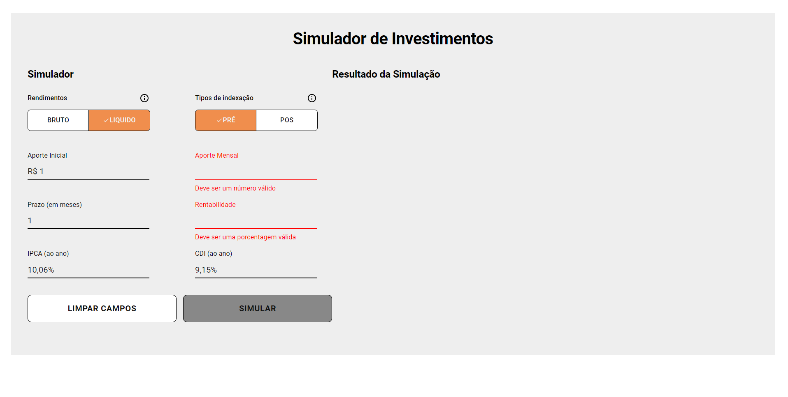
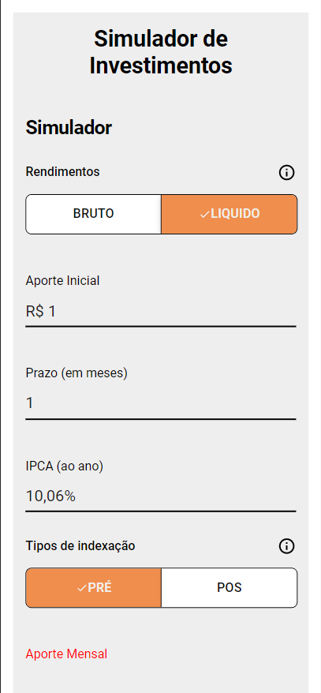
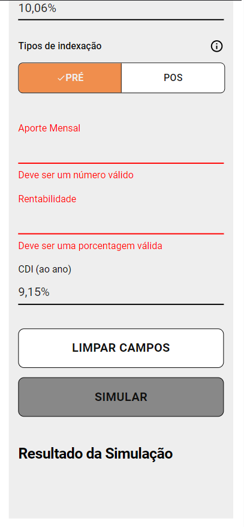

# Simulador de Investimentos

## Web

  

## Mobile

  
  

## Tecnologias

- React
- Javascript
- Material UI
- Vite

## Requisitos para inicializar a Aplicação

- Node.js
- NPM, Yarn ou Pnpm

## Como Inicializar a Aplicação

- Clone o repositório
- cd simulador-de-investimentos
- execute o comando `npm install` ou `yarn install` ou `pnpm install`
- excute o comando `npm dev` ou `yarn dev` ou `pnpm dev`
- acesse localhost na porta 3001
